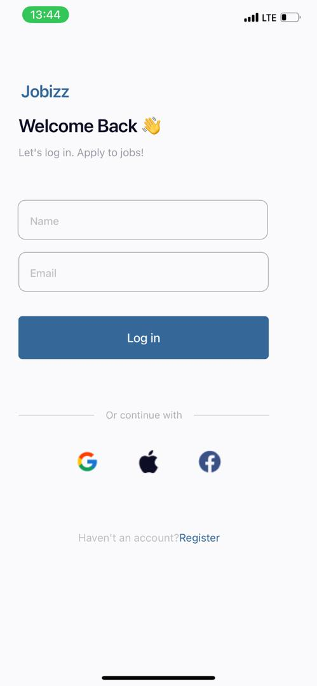

# rn-assignment4-11227574

# RN Assignment 4
# 11227574
This project is a React Native application that includes a login screen and a home screen. The home screen displays the user's name and email passed from the login screen, along with sections for popular and featured job cards.

## Components

### LoginScreen
- **Usage**: Captures the user's name and email. Upon clicking the "Log in" button, it navigates to the `HomeScreen` and passes the name and email as parameters.

### HomeScreen
- **Usage**: Displays the user's name and email passed from the `LoginScreen`. It also shows sections for popular and featured jobs, using the `JobCard` component to list job cards.

### Screenshot

